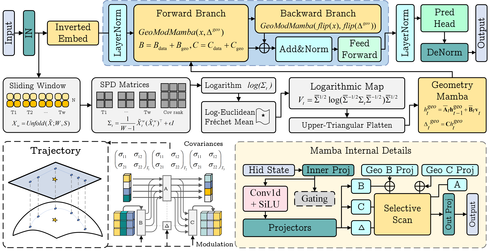
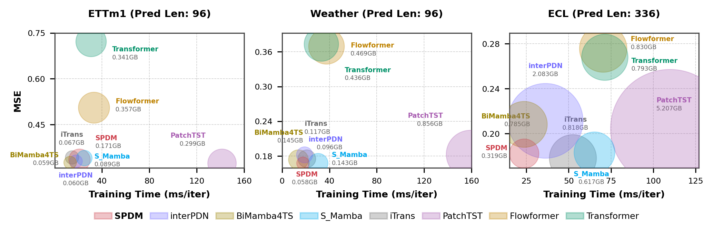

# SPDM: Geometry-Modulated State Space Modeling with Manifold Constraints for Time Series Forecasting

Existing state-space models process multivariate time series by scanning tokenized sequences, discarding the continuously evolving geometric structure of cross-variable correlations. SPDM introduces **manifold-constrained state-space dynamics**: treating the evolving correlation structure as a continuous Riemannian trajectory on the SPD manifold $\mathcal{P}_N$, projecting it to a Euclidean tangent space via the log-Euclidean Fréchet mean, and directly injecting the resulting geometric signals into the SSM's selective parameters. This preserves the linear-time complexity of the Mamba parallel scan, and makes the selective scan itself topology-aware, since geometry is not an auxiliary input but a formative component of the state-space dynamics. Experiments on **11** **real-world benchmarks** establish SOTA forecasting performance, with ablation studies confirming that manifold-constrained dynamics are the dominant factor behind these gains. `<a href="https://arxiv.org/abs/2606.09917">``</a>`

<p align="center">
  
</p>

## Citation

```bibtex
@article{chen2026spdm,
      title={SPDM: Geometry-Modulated State Space Modeling with Manifold Constraints for Time Series Forecasting}, 
      author={Xingsheng Chen and Siu-Ming Yiu},
      year={2026},
      eprint={2606.09917},
      archivePrefix={arXiv},
      primaryClass={cs.LG},
      url={https://arxiv.org/abs/2606.09917}, 
}
```

## Installation

### Environment Requirements

- Python 3.12.12
- PyTorch 2.8.0 and CUDA 12.8
- Mamba SSM 2.3.1

### Step 1: Create Conda Environment

```bash
conda env create -f environment.yml && conda activate spdm
```

### Step 2: Install CUDA Runtime and PyTorch

```bash
conda install nvidia/label/cuda-12.8.0::cuda-runtime -y &&
pip install torch==2.8.0 --index-url https://download.pytorch.org/whl/cu128 &&
pip install poetry
```

### Step 3: Install Mamba Dependencies

```bash
cd wheels &&
pip install causal_conv1d-1.6.1+cu12torch2.8cxx11abiTRUE-cp312-cp312-linux_x86_64.whl &&
pip install mamba_ssm-2.3.1+cu12torch2.8cxx11abiTRUE-cp312-cp312-linux_x86_64.whl
```

### Step 4: Install Additional Dependencies

```bash
poetry install
```

### Verify Setup

```bash
poetry run poe cuda
```

### Data

Place datasets under `./data/` (e.g. `./data/ETT-small/`, `./data/weather/`, `./data/exchange_rate/`).

## Quick Start

```bash
python -u scripts/run.py --is_training 1 --model ManiMamba --data ETTh1 \
    --model_id ETTh1_96_96 --des MULTI_PRED \
    --root_path ./data/ETT-small/ --data_path ETTh1.csv --features M \
    --seq_len 96 --pred_len 96 --e_layers 2 --enc_in 7 --c_out 7 \
    --d_model 256 --learning_rate 5e-4 --optim "AdamW" \
    --weight_decay 1e-6 --train_epochs 15 --patience 5
```

## Experimental Results

SPDM achieves the **best overall average MSE or MAE** on ETTh1, ETTh2, Weather, and Illness across eleven real-world benchmarks, and ranks second on ETTm1, ETTm2, and ECL. On PEMS traffic benchmarks, it attains top-two MSE at short horizons across subsets. Ablation studies confirm that direct additive $B+C$ geometric injection is the dominant performance factor, with its contribution scaling with dataset dimensionality — removing it degrades MSE by 12.6% on ECL ($N = 321$). SPDM also delivers substantial efficiency gains (23 ms/iter on ECL) with compact memory (326 MB), demonstrates strong noise resilience (MSE growth capped at 11% under $\sigma = 0.5$ Gaussian perturbation), and maintains monotonic accuracy improvement as the lookback window expands where baselines plateau or degrade.

<p align="center">
  
</p>

## References

- **[Mamba]** Gu, A. & Dao, T. Mamba: Linear-Time Sequence Modeling with Selective State Spaces. *arXiv:2312.00752*, 2023.
- **[iTransformer]** Liu, Y. et al. iTransformer: Inverted Transformers Are Effective for Time Series Forecasting. *arXiv:2310.06625*, 2024.
- **[S-Mamba]** Wang, Z. et al. Is Mamba Effective for Time Series Forecasting? *Neurocomputing*, 619, 129178, 2025.
